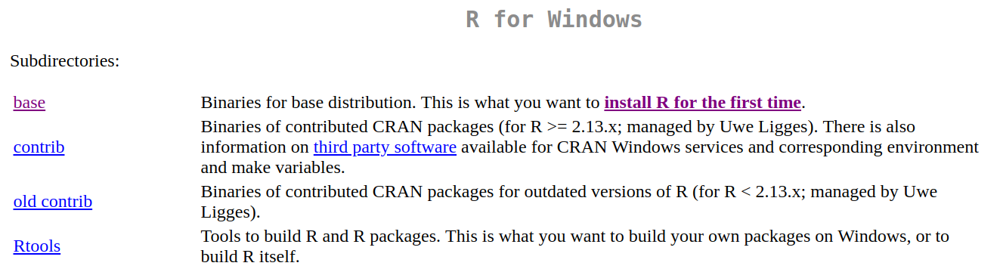
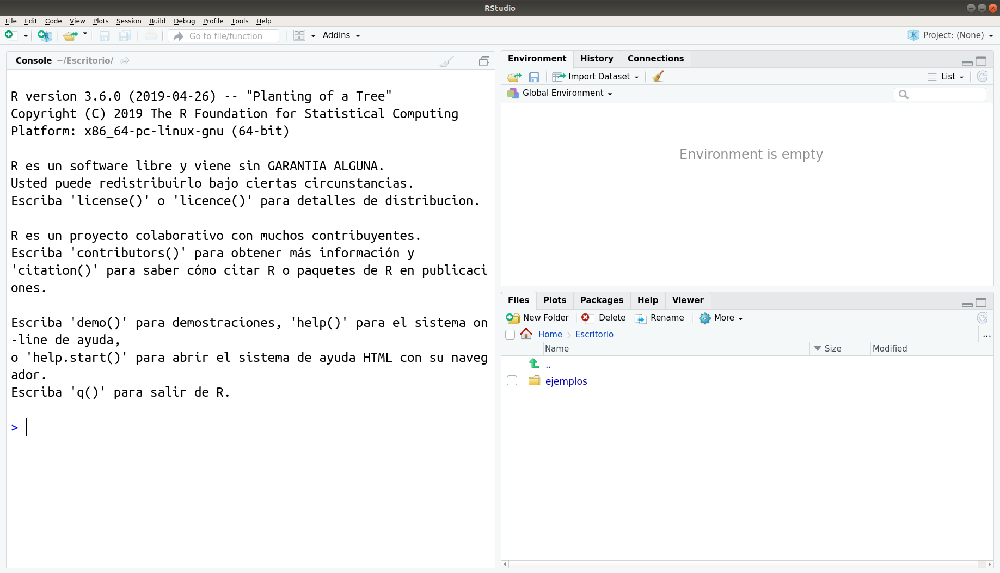

# Indicaciones previas

## Instalación de R y RStudio + RStudio Cloud

En este taller utilizaremos el lenguaje de programación R a través de una plataforma que facilita su uso: RStudio. RStudio es un IDE, es decir, un *Entorno de Desarrollo Integrado* (IDE es el acrónimo de *Integrated Development Environment*). Esto quiere decir que RStudio es una aplicación que nos entrega herramientas para hacer más fácil el desarrollo de proyectos usando R.

Hay dos maneras de utilizarlo: en la nube o instalar todo localmente. Ambas tienen ventajas y desventajas:

**RStudio Cloud**

- *Ventajas*: no requiere instalar nada en tu computador; solo crearte una cuenta. Como tus proyectos están en línea, puedes acceder a ellos desde cualquier computador y compartirlos con otras personas.
- *Desventaja*: requiere conexión a internet y la versión gratuita tiene un límite en la cantidad y tamaño de proyectos que puedes tener.

**RStudio en tu computador**

- *Ventajas*: no necesitas conexión a internet para trabajar (pero sí para agregar funciones extra a las que vienen instaladas por defecto). También es más intuitivo trabajar con los archivos que están en tu computador (tanto para leerlos como para crear archivos nuevos).
- *Desventajas*: implica instalar cosas. Ese proceso debería ser sencillo; sin embargo, cada computador es distinto y a veces es posible encontrarse con problemas. De todos modos, nunca serás la primera persona en haber tenido un problema, así que suele ser fácil encontrar una solución en internet.

A continuación mostraremos el paso a paso para ambas opciones. Para la primera sesión es necesario que tengas todo instalado ya en tu computador. La sugerencia es que crees también una cuenta en RStudio Cloud como respaldo por si algo llega a fallar en algún momento.

### Preparar tu computador

Necesitarás instalar tanto R como RStudio. Para ello, sigue los siguientes pasos (¡en orden!).

#### 1. Instala R

Puedes descargar R desde https://cran.r-project.org/. Debes elegir la opción que corresponda, según tu sistema operativo.

Si utilizas Windows, te preguntará qué es lo que quieres instalar. Selecciona "base". Luego de seguir los pasos de instalación, instala "Rtools" (el cuarto enlace de este mismo menú).

En el caso de Mac, elige la primera opción que aparece bajo "Latest release", es decir, "R-4.1.3.pkg (notarized and signed)".

Luego, sigue los pasos de instalación, tal como lo haces con cualquier programa.

Si todo sale bien, al abrir R en tu computador deberías ver algo parecido a esto en Windows:

Y en Mac se debería ver algo así:

(La información sobre la versión de R y sobre el sistema operativo que aparece en ese mensaje inicial serán distintos en tu caso.)

#### 2. Instala RStudio

- Una vez que R ha quedado correctamente instalado, descarga RStudio desde <https://www.rstudio.com/products/rstudio/download/>. Elige la primera opción, es decir, "RStudio Desktop Open Source License" (gratuita).
- Instala RStudio en tu computador, tal como lo haces con cualquier programa.

Si quedó todo bien instalado, cuando abras RStudio deberías ver algo parecido a esto (algunas cosas pueden variar según tu sistema operativo):

A lo largo del taller usaremos una versión reciente de R y RStudio, así que si tienes instalada una versión previa, puede que algunas cosas se vean un poco distintas. Versiones de R anteriores a la 4.0.1 harán que algunas cosas no funcionen, por lo que si ese es tu caso, mejor actualizar todo. La última versión de R es la 4.1.0 y la última de RStudio la 2022.02.0-443.

### RStudio Cloud

#### 1. Accede a  <https://rstudio.cloud/>

#### 2. Crea una cuenta
Haz clic en "Sign up" e ingresa tus datos.

Una vez que hayas creado una cuenta, verás algo así. Este es tu espacio de trabajo.

¡Listo! Ya tienes todo lo necesario para la primera sesión.
